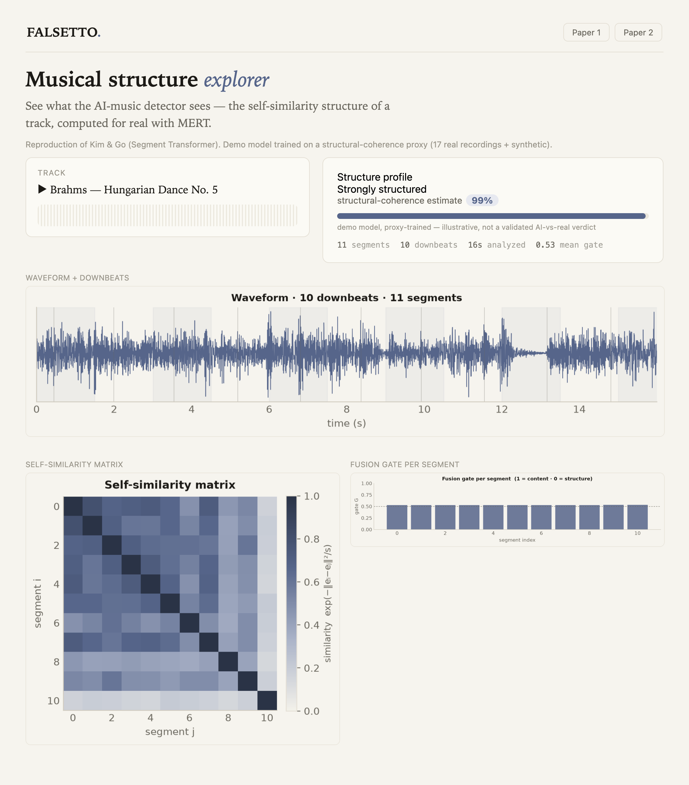

# FALSETTO

**Detecting AI-generated music through musical structure.** A from-scratch
reimplementation of the two-stage *Segment Transformer* detector, which classifies
a full track as real or AI-generated by analyzing how its short segments relate to
one another over time.

**[▶ Results site](https://arnavmahadev.github.io/Falsetto/)**  ·  **[What it reproduces](#what-this-reproduces)**  ·  **[Results](#results)**  ·  **[Train it on a GPU (Colab)](notebooks/train_stage1_colab.ipynb)**

> **Status: a complete, working reimplementation.** Both papers' models (AudioCAT,
> FX-Segment, Segment Transformer, Fusion Segment Transformer), the full data pipeline,
> training/eval loops, inference, and an interactive demo are implemented and covered by a
> 56-test suite, verified on real MERT features. **Stage-1 is trained end-to-end** via the
> [Colab notebook](notebooks/train_stage1_colab.ipynb), reaching **0.875 accuracy / 0.972 AUC** on a held-out
> test of a proxy task (real music vs. MusicGen). That shows the pipeline learns; it is *not* the
> paper's benchmark. Reproducing the papers' *benchmark accuracy* is a bounded data + GPU scale-up,
> not missing work: the labeled datasets run to tens of GB to TB, and the same code path scales to them.
> Full numbers on the [results page](https://arnavmahadev.github.io/Falsetto/).

## What this reproduces

FALSETTO reimplements the detection system from two papers by Kim & Go (MIPPIA):

1. **Segment Transformer: AI-Generated Music Detection via Music Structural Analysis** ([arXiv:2509.08283](https://arxiv.org/abs/2509.08283))
2. **Fusion Segment Transformer: Bi-Directional Attention Guided Fusion Network for AI-Generated Music Detection** ([arXiv:2601.13647](https://arxiv.org/abs/2601.13647))

The core idea: AI music generators produce audio that can sound convincing second to
second but is often structurally inconsistent across a whole song. Rather than
classifying a single short clip, the model embeds many segments of a track and reasons
over their **self-similarity structure** to decide real vs. AI.

## How it works

The system is two stages: a segment-level encoder, then a track-level classifier.

```
STAGE 1: short clip → embedding + real/AI
  audio clip → [feature extractor] → [AudioCAT / FX-Segment] → segment embedding

STAGE 2: full track → real/AI
  full track → beat-track → 4-bar segments
             → embed each segment with Stage 1 → sequence (pad/crop to 48)
             → self-similarity matrix + dual-stream transformer + fusion → real/AI
```

- **Stage 1 (segment encoder).** A pretrained audio feature extractor (MERT, Wav2Vec 2.0,
  Music2Vec, or FXencoder) feeds a small transformer (`AudioCAT` cross-attention decoder,
  or a self-attention `FX-Segment` head) that produces one embedding per segment.
- **Stage 2 (structure classifier).** A track is split into 4-bar segments on detected
  downbeats and embedded into a length-48 sequence. A **self-similarity matrix** captures
  how segments repeat and vary; a **dual-stream transformer** processes the embedding
  sequence and the similarity structure in parallel.
- **Fusion (Paper 2).** The two streams are combined with **bi-directional cross-attention**
  and a **gated multimodal unit**, which learns per-segment how much to weight content vs.
  structure. That per-segment gating is the headline contribution of the second paper.

## Results

Everything measured lives on the **[results page](https://arnavmahadev.github.io/Falsetto/)**: the
benchmark landscape both papers report, the Stage-1 functional check, and the pipeline's own output
on every bundled example clip.

That last part is real output, not a mock-up. `scripts/build_site_data.py` runs the actual MERT /
beat-tracking / SSM / Fusion pipeline over the example set and writes the self-similarity matrices
and structure estimates straight into the page, so the site can't quietly drift from the code:

```bash
python scripts/build_site_data.py   # recompute; rewrites the data block in docs/index.html
```

From the current run: a mean structure estimate of **99%** across the 5 clips expected to be
structured, against **14%** across the 3 expected not to be, with no overlap between the groups.
Structured music shows repeated blocks and diagonals in its self-similarity matrix; drifting or
unstructured audio doesn't.

> **Honest scope.** That is a qualitative check on real audio, not the papers' benchmark. The full
> detector classifies real vs. AI from these structural features, but training it needs the labeled
> datasets (FakeMusicCaps/SONICS/AIME, tens of GB to TB, not bundled), so the **structure estimate**
> comes from a small demo model trained on a *proxy*: structured music versus drifting or
> unstructured audio. The matrices themselves are computed for real. Point `falsetto train` at the
> datasets for a validated detector.

The page is a single self-contained file and hosts free on **GitHub Pages** (Settings → Pages →
*Deploy from branch* → `/docs`). No server, no cold start.

<details>
<summary><b>Local demo app</b> — a dev tool for eyeballing the pipeline, not the showcase</summary>

A small Gradio app renders the same per-track analysis interactively (waveform + detected downbeats,
self-similarity matrix, per-segment fusion gate). It is useful while working on the pipeline; the
results page above is the thing to actually look at.

```bash
pip install -e ".[demo]"
python scripts/demo.py            # builds a small model on first run (~2 min), then launches
```



Deploy packages for **[Modal](deploy/modal/README.md)** (scale-to-zero, free tier) and
**[Hugging Face Spaces](deploy/space/DEPLOY.md)** (HF now requires PRO for non-static Gradio Spaces)
are included if you ever want it hosted.

</details>

## Scope

Full replication targets an RTX 5090 and ~100k tracks. This project deliberately scopes to
a solo build: faithful implementations of every architecture component, trained on subsets.

- **Feature extractors:** MERT (primary) and FXencoder (contrast); others if time allows.
- **Stage 1 data:** FakeMusicCaps (~33k 10-second clips).
- **Stage 2 data:** AIME (12k tracks) or a SONICS subset.
- **Metrics everywhere:** Accuracy, Precision, Recall, F1, AUC, Specificity.

## Setup

**Requirements:** Python **3.10-3.12** (3.11 recommended; PyTorch has no 3.13/3.14
wheels yet). Accelerator target: **CUDA** or **Apple MPS**, with CPU fallback.

```bash
python3.11 -m venv .venv
source .venv/bin/activate
pip install -e .                 # core: torch, torchaudio, transformers, librosa, …
# optional extras:
pip install -e ".[wandb]"        # W&B tracker instead of TensorBoard
pip install -e ".[beat]"         # Beat This! downbeat tracking (Phase 4)
pip install -e ".[demo]"         # Gradio demo (Phase 7)

python scripts/check_env.py      # prints torch + CUDA/MPS availability
python scripts/smoke_utils.py    # exercises seed/device/tracker/audio-io
```

Verified on macOS (Apple Silicon, MPS) with Python 3.11, torch 2.13.

## Training & metrics on a GPU

The fastest way to get **real Stage-1 metrics** (Accuracy/F1/AUC plus a confusion matrix) is the
Colab notebook. It clones the repo, builds a balanced dataset, trains frozen-MERT → AudioCAT, and
plots results:

- **[notebooks/train_stage1_colab.ipynb](notebooks/train_stage1_colab.ipynb)**: runs today on a
  free GPU with a self-contained proxy (open real music vs. MusicGen-generated audio), or against
  the paper's **FakeMusicCaps** benchmark once you have it.

```bash
# Build a balanced, leak-free manifest from any FakeMusicCaps-style tree, then train + eval
python scripts/build_manifest.py --root data/raw/fakemusiccaps \
    --out data/manifests/fakemusiccaps_small.csv --max-per-class 300
falsetto train --config configs/stage1_mert_fakemusiccaps_small.yaml --stage 1
falsetto eval  --config configs/stage1_mert_fakemusiccaps_small.yaml \
    --stage1-ckpt checkpoints/stage1_mert_fakemusiccaps_small/best.pt
```

## Usage

The pipeline is two stages; each has a script and a `falsetto` subcommand.

```bash
# 0. Get data (see docs/DATASETS.md) and build a manifest (8:1:1, no track leakage)
python scripts/download_data.py count --root data/raw/fakemusiccaps
python scripts/build_manifest.py --root data/raw/fakemusiccaps --out data/manifests/fakemusiccaps.csv

# 1. Stage-1: train a segment encoder (extractor -> AudioCAT / FX-Segment)
falsetto train --config configs/stage1_mert_fakemusiccaps.yaml --stage 1
falsetto eval  --config configs/stage1_mert_fakemusiccaps.yaml --stage1-ckpt checkpoints/stage1_mert_fakemusiccaps/best.pt

# 2. Stage-2: precompute 4-bar segment sequences, then train the track-level model
python scripts/build_sequences.py --config configs/stage2_fusion_aime.yaml \
    --stage1-ckpt checkpoints/stage1_mert_fakemusiccaps/best.pt --out data/seqcache
falsetto train --config configs/stage2_fusion_aime.yaml --stage 2 --seqcache data/seqcache

# 3. Predict on any track (audio -> P(AI) + label)
falsetto predict song.mp3 \
    --stage1-config configs/stage1_mert_fakemusiccaps.yaml --stage1-ckpt <s1.pt> \
    --stage2-config configs/stage2_fusion_aime.yaml        --stage2-ckpt <s2.pt>

# 4. Demo app: showcase the pipeline's results on the bundled example tracks
python scripts/demo.py --stage1-config ... --stage1-ckpt ... --stage2-config ... --stage2-ckpt ...

# Tests
pytest -q
```

## Implementation status & scope

Everything below is implemented and unit-tested; the caveats note what a full paper
reproduction additionally requires.

| Component | Status |
|---|---|
| Config system, seeding, device/AMP, logging, audio I/O | ✅ |
| Data: manifests + leak-free 8:1:1 split, per-extractor resampling, fixed & 4-bar segmentation, SSL augmentation, embedding cache | ✅ |
| Extractors: **MERT** & **Wav2Vec 2.0** (verified on real weights), Music2Vec | ✅ |
| Extractors: **FXencoder**, **Muffin** | ⚠️ reference architectures; real weights / pretrain deferred (need external checkpoints) |
| Stage-1: AudioCAT (cross-attention decoder), FX-Segment (self-attention), BCE + focal, 6 metrics, training loop | ✅ |
| Stage-2: Segment Transformer (dual-stream), SSM, beat tracking (Beat This! → librosa fallback) | ✅ |
| Stage-2: **Fusion Segment Transformer** (2 streams, bi-directional cross-attention, gated multimodal unit) | ✅ |
| Eval: results/comparison tables, gate visualization, ablations (segmentation, fusion), significance test | ✅ |
| Inference pipeline + CLI + Gradio demo | ✅ |
| **Training on full datasets to reproduce paper numbers** | ⏳ run on a GPU box; code path verified on synthetic + real-MERT smoke tests |

**Caveats:** FXencoder/Muffin run with reference architectures (correct shapes, frozen)
but need the original authors' weights for meaningful features. MERT is the primary
extractor. Beat tracking uses Beat This! when the optional `beat_this` package is
installed, otherwise a librosa 4/4 fallback. Reported metrics require downloading the
datasets and training on a GPU; the repository ships the full, tested code path, not the
trained checkpoints.

## Datasets

| Dataset | Real | AI | Notes |
|---|---|---|---|
| **FakeMusicCaps** | 5,373 | 27,605 | 10 s clips; 5 text-to-music models (MusicGen, MusicLDM, AudioLDM2, Stable Audio Open, Mustango) |
| **SONICS** | 48,090 | 49,074 | ~176 s avg; Suno + Udio; resample to 16 kHz |
| **AIME** | 6,000 | 6,000 | MTG-Jamendo reals; harder, fewer artifacts |

Audio is not committed to the repo.

## Repository

Planned package layout (`src/falsetto/`): `data/`, `extractors/`, `models/`, `training/`,
`eval/`, `inference/`, `utils/`. Target: Python + PyTorch (CUDA or Apple MPS).

## Credit & attribution

All architectural and methodological credit belongs to **Yumin Kim and Seonghyeon Go**,
the authors of the two papers this project reproduces. FALSETTO is an independent,
unofficial reimplementation for learning purposes and is **not affiliated with or endorsed
by the original authors**.

```bibtex
@article{kim2025segment,
  title   = {Segment Transformer: AI-Generated Music Detection via Music Structural Analysis},
  author  = {Kim, Yumin and Go, Seonghyeon},
  journal = {arXiv preprint arXiv:2509.08283},
  year    = {2025}
}

@article{kim2026fusion,
  title   = {Fusion Segment Transformer: Bi-Directional Attention Guided Fusion Network
             for AI-Generated Music Detection},
  author  = {Kim, Yumin and Go, Seonghyeon},
  journal = {arXiv preprint arXiv:2601.13647},
  year    = {2026}
}
```

### Built on the work of others

This reproduction stands on pretrained models, tools, and datasets released by other
researchers. Each retains its **own license and citation requirements**, so consult the
original source before use or redistribution.

**Feature extractors & tools**
- **MERT**: Li et al., *Acoustic Music Understanding Model with Large-Scale Self-supervised Training* ([arXiv:2306.00107](https://arxiv.org/abs/2306.00107), [code](https://github.com/yizhilll/MERT), [`m-a-p/MERT-v1-95M`](https://huggingface.co/m-a-p/MERT-v1-95M))
- **Wav2Vec 2.0**: Baevski et al. (Meta AI) ([`facebook/wav2vec2-base`](https://huggingface.co/facebook/wav2vec2-base))
- **Music2Vec**: MAP group ([`m-a-p/music2vec-v1`](https://huggingface.co/m-a-p/music2vec-v1))
- **FXencoder**: Koo et al., *Music Mixing Style Transfer: A Contrastive Learning Approach to Disentangle Audio Effects* ([arXiv:2211.02247](https://arxiv.org/abs/2211.02247), [code](https://github.com/jhtonyKoo/music_mixing_style_transfer))
- **Beat This!**: Foscarin, Schlüter & Widmer, *Accurate Beat Tracking Without DBN Postprocessing*, ISMIR 2024 ([arXiv:2407.21658](https://arxiv.org/abs/2407.21658), [code](https://github.com/CPJKU/beat_this))

**Datasets**
- **FakeMusicCaps**: text-to-music detection benchmark (MusicGen, MusicLDM, AudioLDM2, Stable Audio Open, Mustango)
- **SONICS**: large-scale real vs. Suno/Udio detection dataset
- **AIME**: AI-vs-real music evaluation set (with MTG-Jamendo real tracks)
- **MTG-Jamendo**: Bogdanov et al., real-music source used for AIME's real class
